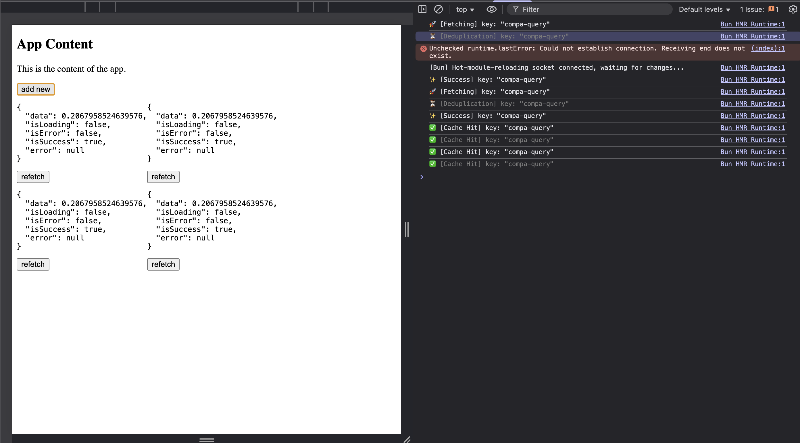
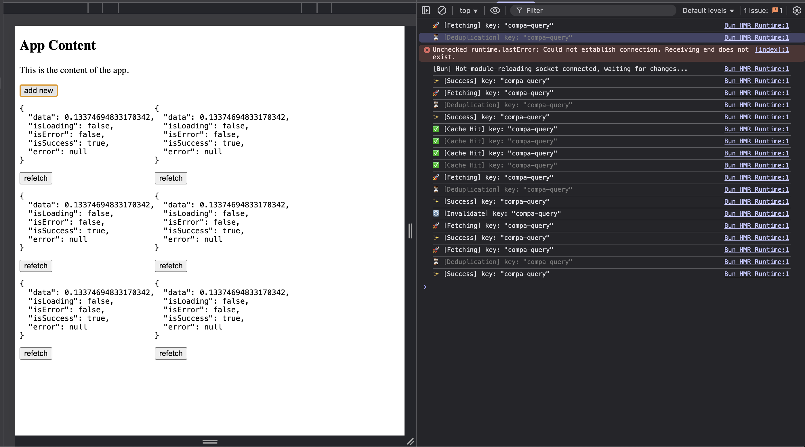

Do you ever use [TanStack Query](https://tanstack.com/query/latest) and think, "Wow, this library is so cool & convenient, they really thought about every edge case and made it easy to use. I wish I could build something like this myself." If so, let's try to build a poor man's version of React Query from scratch.

## What is React Query?

From their site, TanStack Query (formerly known as React Query) is often described as the missing data-fetching library for web applications, but in more technical terms, it makes fetching, caching, synchronizing and updating server state in your web applications a breeze. The library really makes it easy to manage data fetching and state management in our web applications.

The usage example is as follows:

```tsx title="example.tsx"
import { QueryClient, QueryClientProvider, useQuery } from '@tanstack/react-query';

const queryClient = new QueryClient();

export default function App() {
  return (
    <QueryClientProvider client={queryClient}>
      <Example />
    </QueryClientProvider>
  );
}

function Example() {
  const { isPending, error, data } = useQuery({
    queryKey: ['repoData'],
    staleTime: 10 * 1000, // 10 seconds
    queryFn: () =>
      fetch('https://api.github.com/repos/TanStack/query').then((res) => res.json()),
  });

  if (isPending) return 'Loading...';

  if (error) return 'An error has occurred: ' + error.message;

  return (
    <div>
      <h1>{data.name}</h1>
      <p>{data.description}</p>
      <strong>👀 {data.subscribers_count}</strong>{' '}
      <strong>✨ {data.stargazers_count}</strong> <strong>🍴 {data.forks_count}</strong>
    </div>
  );
}
```

We see that the library provides loading state, error state, and data state. It really helps to tackle a common use case of data fetching. And we also see that the API requires a key to identify the query and a function that will be used to fetch the data.

The key will be used to keep track of the query results, making other queries with the same key share the same data. This is useful for caching and reusing data across different components. It helps to reduce multiple requests for the same data if requested within the `staleTime` window and improves the performance of our application by caching the data in memory.

To keep this post short, we will only cover the core functionality of TanStack Query, such as:

1. Fetching states (isLoading, isError, isSuccess)
2. Simple caching mechanism (cache key, staleTime, invalidation)
3. Shared state across components

Alright, let's roll up our sleeves and build this thing step by step!

## Step 1: Setting Up the Foundation

Before we dive into the fancy stuff, we need to define what data we're actually tracking. Think of this as the blueprint for our query state.

```typescript
type QueryStatus = 'idle' | 'loading' | 'success' | 'error';

interface QueryState<T = any> {
  data: T | undefined;
  status: QueryStatus;
  error: Error | null;
  lastFetchedAt: number;
  staleTime: number;
}
```

This is pretty straightforward - we're tracking:

- `data`: The actual data we fetched (or undefined if we haven't fetched yet)
- `status`: Where we are in the fetch lifecycle
- `error`: Any error that occurred during fetching
- `lastFetchedAt`: Timestamp of when we last successfully fetched data
- `staleTime`: How long (in milliseconds) the data stays "fresh"

This follows the **State Pattern** - instead of having a bunch of boolean flags scattered around (`isLoading`, `hasError`, `hasData`), we have one clear status that tells us exactly what's happening at any moment.

## Step 2: Building the QueryClient

Now let's create the `QueryClient` class. This is where all the magic happens - it's going to store our queries, manage subscriptions, and handle fetching.

```typescript
type Listener = () => void;

class QueryClient {
  private queries: Map<string, QueryState>;
  private queryFns: Map<string, () => Promise<any>>;
  private listeners: Map<string, Set<Listener>>;

  constructor() {
    this.queries = new Map();
    this.queryFns = new Map();
    this.listeners = new Map();
  }

  getQueryState<T>(key: string): QueryState<T> | undefined {
    return this.queries.get(key);
  }
}
```

Here's what we're storing:

- `queries`: Our cache! Maps query keys to their current state
- `queryFns`: Remembers the fetch functions so we can re-run them when needed
- `listeners`: Components that want to know when data changes (we'll get to this in a sec)

You typically create one `QueryClient` instance for your entire app and share it everywhere (the **Singleton pattern**). It acts as a centralized store for all your query data.

## Step 3: The Observable Pattern

Alright, here's where it gets interesting. How do we tell React components that data has changed? We use the **Observer Pattern** (also called Pub/Sub).

```typescript
class QueryClient {
  // ... previous code

  subscribe(key: string, listener: Listener): () => void {
    if (!this.listeners.has(key)) {
      this.listeners.set(key, new Set());
    }
    this.listeners.get(key)!.add(listener);

    // Return unsubscribe function
    return () => {
      const listeners = this.listeners.get(key);
      if (listeners) {
        listeners.delete(listener);
        if (listeners.size === 0) {
          this.listeners.delete(key);
        }
      }
    };
  }

  private notify(key: string) {
    const listeners = this.listeners.get(key);
    if (listeners) {
      listeners.forEach((listener) => listener());
    }
  }

  private setQueryState(key: string, state: QueryState) {
    this.queries.set(key, state);
    this.notify(key); // Tell everyone who's listening!
  }
}
```

Here's how this works:

1. Components call `subscribe()` and say "Hey, let me know when this query changes"
2. We store their callback in a Set (multiple components can watch the same query)
3. Whenever we update the query state, we `notify()` all listeners
4. We return an unsubscribe function so components can clean up when they unmount

The QueryClient is the "subject" that maintains a list of "observers" (React components). When the subject's state changes, it notifies all observers automatically. Think of it like subscribing to a newsletter - you sign up (subscribe), get updates when new content arrives (notify), and can unsubscribe anytime you want.

This pattern shows up everywhere in UI frameworks - it's literally how React itself works under the hood!

## Step 4: The Caching Logic

Now for the fun part - the actual fetching and caching logic. This is what makes React Query so powerful.

```typescript
class QueryClient {
  // ... previous code

  async fetchQuery<T>(
    key: string,
    queryFn: () => Promise<T>,
    options: { staleTime?: number } = {},
  ): Promise<T> {
    const { staleTime = 0 } = options;

    this.queryFns.set(key, queryFn);

    const existingQuery = this.queries.get(key);

    // Check if we have fresh cached data
    if (existingQuery && existingQuery.status === 'success') {
      const age = Date.now() - existingQuery.lastFetchedAt;
      if (age < existingQuery.staleTime) {
        console.log(`✅ [Cache Hit] key: "${key}"`);
        return existingQuery.data;
      }
    }

    // Request deduplication - if already loading, wait for it
    if (existingQuery?.status === 'loading') {
      console.log(`⏳ [Deduplication] key: "${key}"`);
      return new Promise((resolve, reject) => {
        const unsubscribe = this.subscribe(key, () => {
          const state = this.queries.get(key);
          if (state && state.status !== 'loading') {
            unsubscribe();
            if (state.status === 'success') {
              resolve(state.data);
            } else if (state.status === 'error') {
              reject(state.error);
            }
          }
        });
      });
    }

    // Actually fetch the data
    console.log(`🚀 [Fetching] key: "${key}"`);
    this.setQueryState(key, {
      data: existingQuery?.data ?? undefined,
      status: 'loading',
      error: null,
      lastFetchedAt: existingQuery?.lastFetchedAt || 0,
      staleTime,
    });

    try {
      const data = await queryFn();
      console.log(`✨ [Success] key: "${key}"`);
      this.setQueryState(key, {
        data,
        status: 'success',
        error: null,
        lastFetchedAt: Date.now(),
        staleTime,
      });
      return data;
    } catch (error) {
      const err = error instanceof Error ? error : new Error(String(error));
      console.log(`❌ [Error] key: "${key}"`, err.message);
      this.setQueryState(key, {
        data: existingQuery?.data,
        status: 'error',
        error: err,
        lastFetchedAt: existingQuery?.lastFetchedAt || 0,
        staleTime,
      });
      throw err;
    }
  }

  invalidateQuery(key: string) {
    const queryFn = this.queryFns.get(key);
    const queryState = this.queries.get(key);

    if (queryState && queryFn) {
      console.log(`🔄 [Invalidate] key: "${key}"`);
      this.queries.delete(key);
      this.fetchQuery(key, queryFn, { staleTime: queryState.staleTime });
    }
  }
}
```

Let's break down what's happening here:

**1. Cache Check (The Fast Path)**

```typescript
if (existingQuery && existingQuery.status === 'success') {
  const age = Date.now() - existingQuery.lastFetchedAt;
  if (age < existingQuery.staleTime) {
    return existingQuery.data; // Return cached data!
  }
}
```

Before we make any network request, we check if we already have fresh data. If the data is younger than `staleTime`, we just return it immediately. No network request needed!

**2. Request Deduplication (The Smart Path)**

```typescript
if (existingQuery?.status === 'loading') {
  // Wait for the existing request instead of making a new one
  return new Promise((resolve, reject) => {
    const unsubscribe = this.subscribe(key, () => {
      // When the request finishes, resolve/reject this promise
    });
  });
}
```

If a request is already in flight, we don't start a new one. Instead, we subscribe to the existing request and wait for it to finish. This prevents duplicate requests when multiple components mount at the same time.

**3. The Actual Fetch (The Slow Path)**
If we don't have fresh cached data and nothing is currently loading, we actually fetch the data, update the state, and notify all listeners.

What we've built here is the **Cache-Aside pattern** - check the cache first, and only hit the API if we don't have fresh data. We also avoid duplicate work by sharing in-flight requests (like memoization). This is exactly how databases, CDNs, and browser caches work too.

Here's a visual of how the caching flow works:

```
Component calls fetchQuery
           |
           v
   Have cached data?
      /          \
    Yes           No
     |             |
     v             |
Data fresh?        |
   /    \          |
 Yes    No         |
  |      |         |
  v      +---------+
Return             |
cached             v
data ✅      Already loading?
                /         \
              Yes         No
               |           |
               v           v
           Wait for    Fetch from API
              it           |
              ⏳           v
               |      Success/Error
               |           |
               +-----------+
                           v
                    Update cache +
                    notify listeners ✨
```



## Step 5: Building the useQuery Hook

Now we need to create a React hook that uses our `QueryClient`. This is where we bring everything together and make it easy to use in components.

```typescript
const queryClient = new QueryClient();

interface UseQueryOptions<T = any> {
  queryKey: string;
  queryFn: () => Promise<T>;
  staleTime?: number;
}

function useQuery<T>(params: UseQueryOptions<T>) {
  const { queryKey, queryFn, staleTime = 0 } = params;

  // Store the latest queryFn in a ref to avoid triggering effects on every render
  const queryFnRef = useRef(queryFn);
  queryFnRef.current = queryFn;

  useEffect(() => {
    queryClient.fetchQuery(queryKey, queryFnRef.current, { staleTime });
  }, [queryKey, staleTime]); // Only re-fetch when key or staleTime changes

  const state = useSyncExternalStore(
    (callback) => queryClient.subscribe(queryKey, callback),
    () => queryClient.getQueryState<T>(queryKey),
  );

  return {
    data: state?.data,
    isLoading: state?.status === 'loading',
    isError: state?.status === 'error',
    isSuccess: state?.status === 'success',
    error: state?.error,
    refetch: () => queryClient.invalidateQuery(queryKey),
  };
}
```

Let's break down the key parts:

**1. The useRef Trick**

```typescript
const queryFnRef = useRef(queryFn);
queryFnRef.current = queryFn;
```

We store the `queryFn` in a ref so we always have the latest version, but it doesn't trigger the useEffect when it changes. This prevents unnecessary re-fetches when the component re-renders with a new function reference.

**2. The Fetch Effect**

```typescript
useEffect(() => {
  queryClient.fetchQuery(queryKey, queryFnRef.current, { staleTime });
}, [queryKey, staleTime]);
```

When the component mounts (or when the key/staleTime changes), we trigger a fetch. The `fetchQuery` method is smart enough to return cached data if it's still fresh.

**3. The useSyncExternalStore Magic**

```typescript
const state = useSyncExternalStore(
  (callback) => queryClient.subscribe(queryKey, callback),
  () => queryClient.getQueryState<T>(queryKey),
);
```

This is a React 18 hook that's perfect for our use case! It does the following:

- **Subscribes** to our QueryClient (first argument)
- **Gets** the current state snapshot (second argument)
- **Re-renders** the component when the state changes
- **Handles** all the edge cases around concurrent rendering

We're basically adapting our QueryClient (which knows nothing about React) to work seamlessly with React's rendering model. `useSyncExternalStore` is the bridge - the **Adapter pattern** in action - connecting our external state management to React's internal state system.

## Step 6: Putting It All Together

Now let's see our poor man's React Query in action:

```tsx
export function App() {
  const [count, setCount] = useState(1);
  return (
    <div>
      <h2>App Content</h2>
      <button onClick={() => setCount(count + 1)}>Add new component</button>
      <div style={{ display: 'flex', flexWrap: 'wrap' }}>
        {new Array(count).fill(0).map((_, i) => (
          <CompA key={i} />
        ))}
      </div>
    </div>
  );
}

function CompA() {
  const query = useQuery({
    queryKey: 'compa-query',
    queryFn: async () => {
      await new Promise((resolve) => setTimeout(resolve, 1000));
      return Math.random();
    },
    staleTime: 10000, // 10 seconds
  });

  return (
    <div>
      <pre>{JSON.stringify(query, (k, v) => (v === undefined ? 'undefined' : v), 2)}</pre>
      <button onClick={() => query.refetch()}>refetch</button>
    </div>
  );
}
```

Here's what happens when you run this:

1. **First mount**: Component fetches data, shows loading state, then shows the result
2. **Add more components**: They all share the same cached data instantly (cache hit!)
3. **After 10 seconds**: Data becomes stale, next component mount triggers a new fetch
4. **Click refetch**: Invalidates the cache and fetches fresh data



The magic here is that all `CompA` instances share the same data because they use the same `queryKey`. When one fetches, they all get updated. When the data is still fresh (within 10 seconds), new components just read from the cache.

## What We've Built

Let's recap what our poor man's React Query can do:

- **Caching**: Stores data and reuses it within the staleTime window
- **Automatic Loading States**: Provides `isLoading`, `isError`, `isSuccess`
- **Shared State**: Multiple components using the same key share the same data
- **Request Deduplication**: Prevents duplicate requests for the same data
- **Manual Refetching**: Invalidate and refetch data on demand
- **Observer Pattern**: Components automatically re-render when data changes

## What's Missing (Compared to the Real Thing)

Of course, the real TanStack Query has way more features that we didn't implement:

- **Background refetching**: Automatically refetch when window regains focus or network reconnects
- **Retry logic**: Automatically retry failed requests with exponential backoff
- **Garbage collection**: Clean up unused query data after a timeout
- **Optimistic updates**: Update UI before the server responds
- **Infinite queries**: Load more data patterns (pagination, infinite scroll)
- **Query dependencies**: Make queries depend on other queries
- **Suspense integration**: Work with React Suspense for better loading states
- **DevTools**: Visual debugging of all your queries

But for understanding the core concepts? We've got the essentials down!

## Wrapping Up

And there you have it - a poor man's React Query built from scratch! We've covered a ton of ground: the Observer pattern for subscriptions, cache-aside pattern for performance, request deduplication to avoid waste, and how to connect external state to React with `useSyncExternalStore`.

What's cool is that by building this, you've learned the fundamental patterns that power not just React Query, but tons of other libraries too. The Observer pattern shows up everywhere (Redux, MobX, RxJS). The caching strategy is used in databases, CDNs, and browsers. The subscription model is how WebSockets, event emitters, and even vanilla JavaScript events work.

Next time you use TanStack Query, you'll have a much deeper appreciation for what's happening under the hood. You'll understand why query keys need to be unique, why staleTime is so powerful, and how components magically stay in sync. And who knows, maybe you'll even find yourself reaching for these patterns in your own code!
